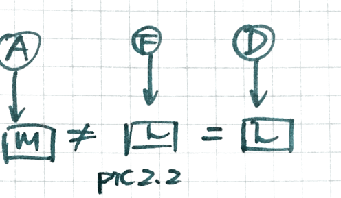
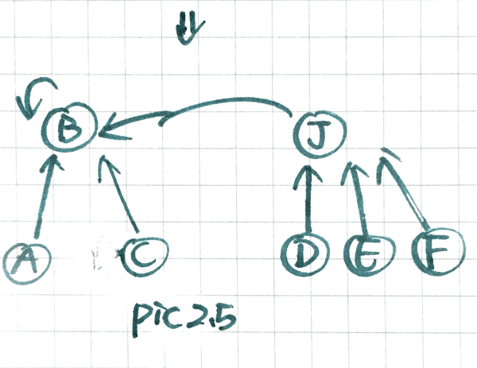

# A Record of My Problem Solving Journey.

Patterns for Coding Questions

###### [My Daily Coding Records](https://docs.google.com/spreadsheets/d/13oGqFxjJ6pWtuuxWlrWnczDdw-d1yoPx1T9U3GFxDCM/edit#gid=0)

## Getting Started

### Union Find

What is Union Find?

Union Find is data structure:

A, B, C, D are working in Microsoft, so each of them all point to Microsoft. So Microsoft is the set they belong to.

D, E, F, J are working in Linkedin, so all of these four point to Linkedin, the big brother is Linkedin, aka they belong to Linkedin.


So what does this set thing mean? Assuming A met F in a restaurant， A saw the ID card of F, A knows F is working in Linkedin, F knows A is working in M, they know they are not serving for same set(company). Then D comes, then F knows D is his co-worker.



After Microsoft merged Linkedin, the easiest way is to let Linkedin serve Microsoft. Then everyone in Linkedin knows their boss belongs to Microsoft, aka they also belong to Microsoft.


At this state, we don't need to use M and L for two different sets, we can choose their boss replace.

e.g M has A,B,C,D, we choose B(Bill Gates), Linkedin we choose J.


After L is merged. it becomes this,



#### There are three major operations for Union Find.

Initialization, Find, Union

1. Initialization

   After initialisation, father of each element is itself, aka I'm the boss of myself, it could be changed depend on different conditions. e.g.

   ```java
   public int[] father = null;
   public UnionFind(int n) {
     father = new int[n + 1];
     for (int i = 1; i <= n; i++) {
       father[i] = i;
     }
   }
   ```

  2. Find

      To find which set this element belongs to, that means find its boss! This is also the basics we merge two sets.

      If two elements are in same set, do nothing, otherwise merge.

      ```java
      public int find(int x) {
        if (father[x] == x) {
          return x;
        }
        father[x] = find(father[x]);
        return father[x];
      }
      ```

  3. Union

         Merge two different sets, aka b becomes the boss of a.

         ```java
         public void union(int a, int b) {
            a = find(a);
            b = find(b);
            if (a != b) {
               father[a] = b;
            }
         }
         ```

         
