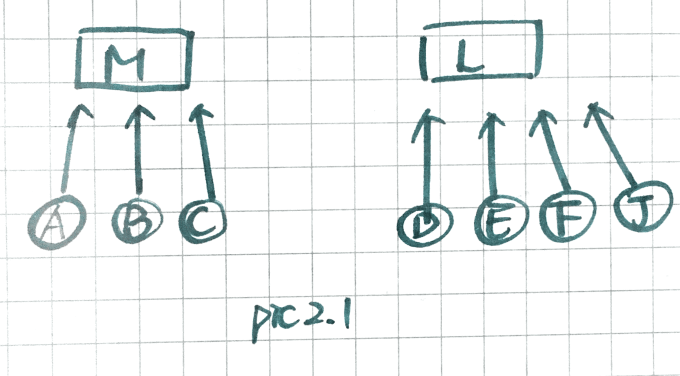
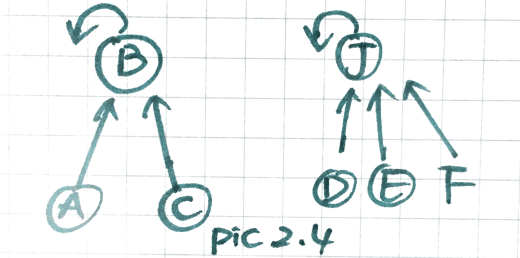
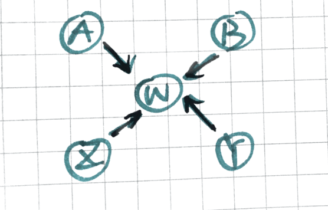

# A Record of My Problem Solving Journey.

Patterns for Coding Questions

#### Table Of Content
##### [Union Find](https://github.com/xrenaissance/A-Record-of-My-Problem-Solving-Journey#union-find)
##### [BFS](https://github.com/xrenaissance/A-Record-of-My-Problem-Solving-Journey#breadth-first-searchbfs)
##### [Subsets(DFS)](https://github.com/xrenaissance/A-Record-of-My-Problem-Solving-Journey#subsetsdfs-1)
##### [Sliding Window](https://github.com/xrenaissance/A-Record-of-My-Problem-Solving-Journey#sliding-window-1)
##### [Top K Elements](https://github.com/xrenaissance/A-Record-of-My-Problem-Solving-Journey#top-k-elements-1)
##### [Sweep Line](https://github.com/xrenaissance/A-Record-of-My-Problem-Solving-Journey#sweep-line-1)
##### [K-Way Merge](https://github.com/xrenaissance/A-Record-of-My-Problem-Solving-Journey#k-way-merge-1)
##### [Two Pointers](https://github.com/xrenaissance/A-Record-of-My-Problem-Solving-Journey#two-pointers-1)
##### [Slow and Faster Pointer](https://github.com/xrenaissance/A-Record-of-My-Problem-Solving-Journey#slow-and-faster-pointer-1)
##### [Topological Sort](https://github.com/xrenaissance/A-Record-of-My-Problem-Solving-Journey#topological-sort-1)
##### [Two Heaps](https://github.com/xrenaissance/A-Record-of-My-Problem-Solving-Journey#two-heaps-1)
##### [Math](https://github.com/xrenaissance/A-Record-of-My-Problem-Solving-Journey#math-1)
##### [Bit Operations](https://github.com/xrenaissance/A-Record-of-My-Problem-Solving-Journey#bit-operations-1)
##### [Data Structure Design And Implementation(Tries,HashMap,HashSet,ArrayToTree,Iterator)](https://github.com/xrenaissance/A-Record-of-My-Problem-Solving-Journey/blob/master/README.md#data-structure-design-and-implementationtrieshashmaphashsetarraytotreeiterator)
##### [Concurrency And Threads](https://github.com/xrenaissance/A-Record-of-My-Problem-Solving-Journey/blob/master/README.md#concurrency-and-threads)
##### [OOD](https://github.com/xrenaissance/A-Record-of-My-Problem-Solving-Journey/blob/master/README.md#ood)
##### [System Design](https://github.com/xrenaissance/A-Record-of-My-Problem-Solving-Journey/blob/master/README.md#system-design)
##### [Behavior Questions' Answer Template](https://github.com/xrenaissance/A-Record-of-My-Problem-Solving-Journey/blob/master/README.md#behavior-questions-answer-template)
<br></br>
###### [My Daily Coding Records](https://docs.google.com/spreadsheets/d/13oGqFxjJ6pWtuuxWlrWnczDdw-d1yoPx1T9U3GFxDCM/edit#gid=0)

## Getting Started

### Union Find

What is Union Find?

Union Find is data structure:

A, B, C, D are working in Microsoft, so each of them all point to Microsoft. So Microsoft is the set they belong to.

D, E, F, J are working in Linkedin, so all of these four point to Linkedin, the big brother is Linkedin, aka they belong to Linkedin.



So what does this set thing mean? Assuming A met F in a restaurant， A saw the ID card of F, A knows F is working in Linkedin, F knows A is working in M, they know they are not serving for same set(company). Then D comes, then F knows D is his co-worker.


After Microsoft merged Linkedin, the easiest way is to let Linkedin serve Microsoft. Then everyone in Linkedin knows their boss belongs to Microsoft, aka they also belong to Microsoft.


At this state, we don't need to use M and L for two different sets, we can choose their boss replace.

e.g M has A,B,C,D, we choose B(Bill Gates), Linkedin we choose J.



After L is merged. it becomes this,


#### There are three major operations for Union Find.

Initialization, Find, Union

1. Initialization

   After initialisation, father of each element is itself, aka I'm the boss of myself, it could be changed depend on different conditions. e.g.

   ```java
   public int[] father = null;
   public UnionFind(int n) {
     father = new int[n + 1];
     for (int i = 1; i <= n; i++) {
       father[i] = i;
     }
   }
   ```

  2. Find (Time complexity: O(1))

      To find which set this element belongs to, that means find its boss! This is also the basics we merge two sets.

      If two elements are in same set, do nothing, otherwise merge.

      ```java
      public int find(int x) {
        if (father[x] == x) {
          return x;
        }
        father[x] = find(father[x]);
        return father[x];
      }
      ```

   3. Union (Time Complexity(1))

         Merge two different sets, aka b becomes the boss of a.

         ```java
         public void union(int a, int b) {
            a = find(a);
            b = find(b);
            if (a != b) {
               father[a] = b;
            }
         }
         ```

         #### The time complexity of compressed union find.
         
         Union Find without compressing path
         
         ```java
         public int find(int x) {
            if (father[x] == x) {
               return x;
            }
            return find(father[x]);
         } 
         ```
         
         Union Find with compressing path.
         Recursion
         ```java
         public int find(int x) {
            if (father[x] == x) {
               return x;
            }
            father[x] = find(father[x]);
            return father[x];
         }
         ```
         Iteration
         ```java
         public int find(int x) {
            int parent = father[x];
            while (parent != father[parent]) {
               parent = father[parent];
            }
            int temp = -1;
            int boss = x;
            while (boss != father[boss]) {
               temp = father[boss];
               father[boss] = parent;
               boss = temp;
            }
            return parent;
         }
         ```
         The idea of compressing path
         
         Assuming there is a path, A -> B -> Z -> Y -> W, we want to know who's the boss of A, we have to go though A, B,Z,Y then W,  so every time, for each node has to go though again, aka redundant computation.
         
         The follwing graph shows how compressed path works.
         


Then a linked list becomes everyone points to boss.



So amortiezed time complexity of find is O(1), same as union, O(1) as well.

##### Questions which are solved via Union Find
```
Leetcode 130 Surrounded Regions

Leetcode 200 Number of Islands

Leetcdoe 305 Number of Islands 305

Leetcode 261 Graph valid Tree

Leetcode 547 Friend Circles

Leetcode 1135 Connecting Cities With Minimum Cost 
```

### Breadth First Search(BFS)
#### **Applications**: Binary Tree BFS, Graph BFS, Topological Sort, Grid(Board) BFS
#### Over 99% of BFS kinda questions can be solved via BFS template.
#### General Steps to solve BFS questions:
* Generation Rule: how do you want to generate from one state to next state. e.g. avoid redundant visite, upper and lower boundary
* Expantion Rule: From which direction you will generate next state.


### Subsets(DFS)

### Sliding Window

### Sweep Line

### Top K Elements

### K-Way Merge

### Two Pointers

### Slow and Faster Pointer

### LinkedList

### Trees

### Cyclic Sort

### Binary Search

### Merge Intervals

### Dynamic Programming(DP)

### Tries

### Topological Sort

### Two Heaps

### Math

### Bit Operations

### Data Structure Design And Implementation(Tries,HashMap,HashSet,ArrayToTree,Iterator)

#### 1. Two types of Questions about data structure
#### 2. HashTable: a. Theory b. Applications
#### 3. Heap: a. Theory b. Applications - PriorityQueue c. Alternatives - TreeMap

**Types of Question About Data Structures:**

* Design a data structure

* Implement algorithms via one/more data structure

#### Common data structures
* Linear data structure, normally implemented by array, e.g. Queue(LinkedList, ArrayDeque),Stack(Deque),Hash
* Tree data structure, normally reference, e.g binary tree(left, right), graph(nodes, List<Node>), Neary-Tree(node,List<Node>)
* Queue: BFS -> O(1) offer, poll, peek
* Stack: DFS -> O(1) offerLast, pollLast, peekLast

#### Hash
Time Complexity:
   * Add O(keySize)
   * Search(Contains) O(keySize)
   * Remove O(keySize)
If size of key is 4 bytes, then Time complexity of add,search, and remove is O(4) -> O(1)
#### HashTable vs HashMap vs HashSet
   * HashSet only has key no value, it's not ordered, all of keys are unique. -> normally for remove duplicated data
   * HashTabe is thread safe, multiple threads can call one HashTable
   * HashMap doesn't support thread safe,it will mess up if multiple threads call one HashMap. PS: Because lock and unlock is very slow, so HashTable is slower.

#### Hash Function/Hash Code
Target: For any key, it'll transfer to an integer that is in 0 ~ capacity - 1
Understanding: HashMap can be regarded as a huge array, hash function is to find the index, and save the (k,v) to the array.
<<<<<<< HEAD

* 1. char -> 255 Integer
* 2. Simplely get modulus, e.g. key % 31 to transfer 31进制, 31为经验值
   ** mutiply the 经验值 and then get modulus, just for checking corner case
   ** java and c++ will automatically get rid of the cases which are not valid
```java
   public int hashFunc(String key) {
      int sum = 0;
      for (int i = 0; i < key.length(); i++) {
         sum = sum * 31 + (int)(key.charAt(i));
         sum = sum % HASH_TABLE_SIZE;
      }
      return sum;
   }
```
Normally hash function is designed to solve string, which is char, since any other data type can be transfer to char.
e.g. int is 4 bytes, which is 4 chars
double is 8 bytes, which is 8 chars
If class has 2 int and 1 double, then it's will be = 8 + 8 string.

#### Hash Function Collision
* 1. Open Hash Table: If collision existed, then create and save a LinkedList.拉链法类似于上厕所的时候, 看上了一个坑, 就等它, 就在后面排着如果要查找的时候, 就从排着的地方for一遍, 看有没有
* 2. Close Hash Table: 
If colllision existed, then take a position, it kinda like when you go to bathroom, you need to find an available shithole,someone is in that position, you need to find next available position. If someone wants to take my position, then I have to someone else position.

But be careful about close hash, if a key is deleted, it will be labeled as **Available** not ***empty***.
e.g. you add 7, 3, 12 to a Hash Function, and % 5, assume the first part will act like follwing graph.

其中7加到index为2的，3加到index为3的，到12的时候，算出来的index是2，但是2已经被占了，所以向后挪一个，去看看3，结果3也被占了，所以12就被塞到了index为4的地方

当删除3的时候，不能直接把index为3的位置直接标空位，而应该标available，这样查询12的时候，会去2找，没有去看3，发现available，知道之前被占过，然后接着向后找

#### Rehashing
The size of the hash table is not determinate at the very beginning. If the total size of keys is too large(e.g. size >= capacity/10 **10%**), we should double the size of the hash table and rehash keys.
```java
   public class Solution {
      /**
       * @param HashTable: A list of the first node of linked list
       * @param return: A list of the first node of linked list which hava twice size
       */
       public ListNode[] rehashing(ListNode[] hashTable) {
         if (hashTable.length <= 0) {
            return hashTable;
         }
         int newCapacity = 2 * hashTable.length;
         ListNode[] newTable = new ListNode[newCpacity];
         for (int i = 0; i < hashTable.length; i++) {
            while(hashTable[i] != null) {
               int newIndex = (hashTable[i].val % newCapacity + newCapacity) % newCapacity;
               if (newTable[newIndex] == null) {
                  newTable[newIndex] = new ListNode(hashTable[i].val);
               } else {
                  ListNode dummy = newTable[newIndex];
                  while (dummy.next != null) {
                     dummy = dummy.next;
                  }
                  dummy.next = new ListNode(hashTable[i].val);
               }
               hashTable[i] = hashTable[i].next;
            }
         }
         return newTable;
       }
   }
```
#### Stanadar: if actual overtaked space is over 10%, then we need to rehashing
```
size是实际被占的，如果实际被占的空间超过十分之一，冲突率太高。
如果数组需要开的更大，就需要开一个更大的数组，并且把原来的小的copy过去，
类似于动态数组，但是很多时候hash function就会变，所以最好不要轻易折腾，举个栗子：

本来有[4,1,2,3]四个数，其中他们的位置按照%4得到的

我们要扩充数组到八个坑，我们开八个坑，要把1,2,3,4挪过去。
但是这次1,2,3,4要根据%8来找他们的位置，而不是直接copy过去，所以增加了不少计算量
```
#### Hash reconstruction
```
因为哈希表只膨胀， 不收缩， 所以对于是不是加一个又删一个的操作， 
就要偶尔destroy了再重建一个
```

### Concurrency And Threads

### OOD

### System Design

### Behavior Questions' Answer Template
