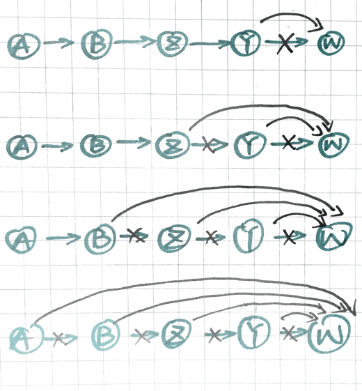
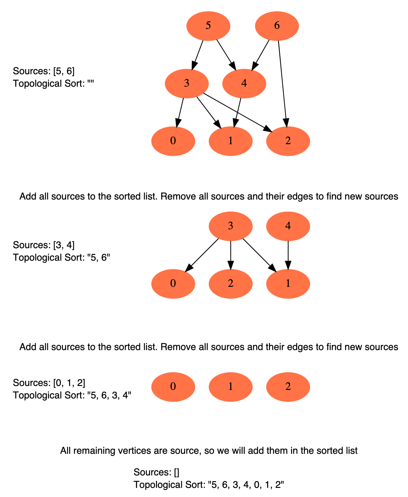
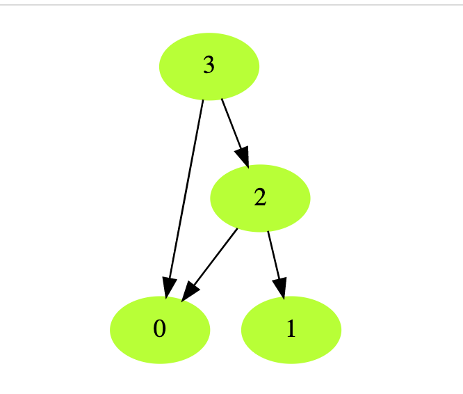
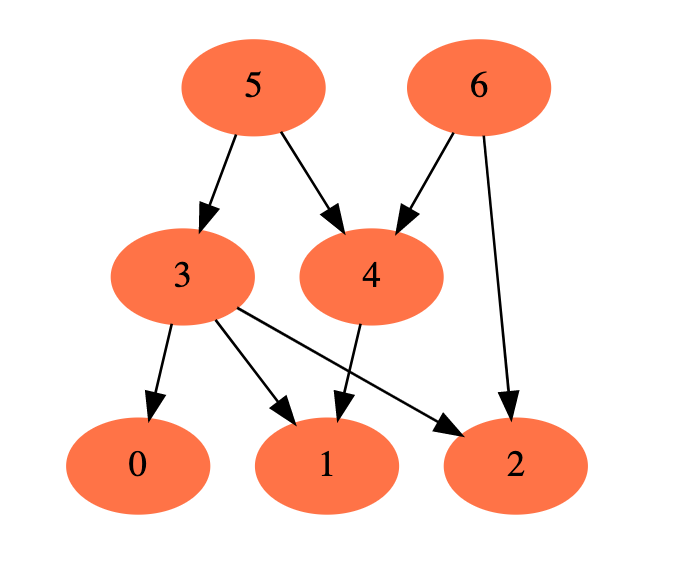
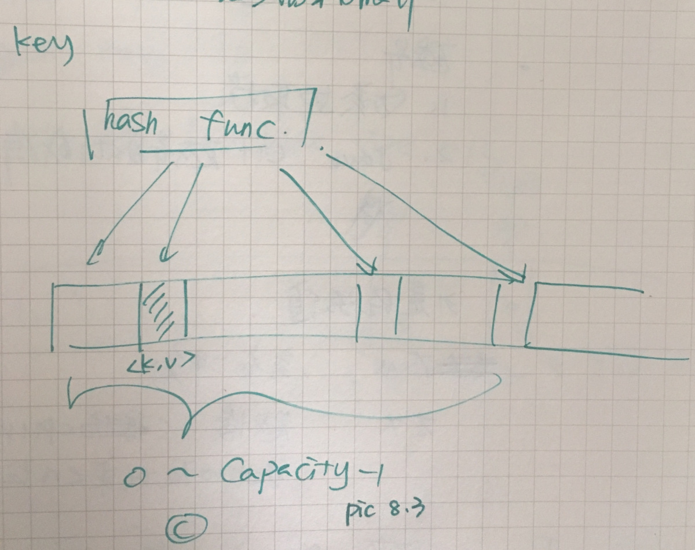
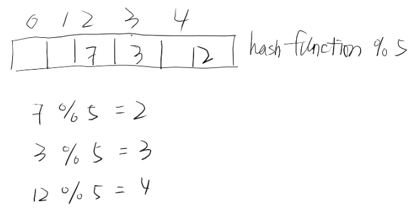

# A Record of My Problem Solving Journey.

Patterns for Coding Questions

#### Table Of Content
##### [Union Find](https://github.com/xrenaissance/A-Record-of-My-Problem-Solving-Journey#union-find)
##### [BFS](https://github.com/xrenaissance/A-Record-of-My-Problem-Solving-Journey#breadth-first-searchbfs)
##### [Subsets(DFS)](https://github.com/xrenaissance/A-Record-of-My-Problem-Solving-Journey#subsetsdfs-1)
##### [Sliding Window](https://github.com/xrenaissance/A-Record-of-My-Problem-Solving-Journey#sliding-window-1)
##### [Top K Elements](https://github.com/xrenaissance/A-Record-of-My-Problem-Solving-Journey#top-k-elements-1)
##### [Merge Intervals](https://github.com/xrenaissance/A-Record-of-My-Problem-Solving-Journey#merge-intervals-1)
##### [Cyclic Sort](https://github.com/xrenaissance/A-Record-of-My-Problem-Solving-Journey#cyclic-sort-1)
##### [Sweep Line](https://github.com/xrenaissance/A-Record-of-My-Problem-Solving-Journey#sweep-line-1)
##### [K-Way Merge](https://github.com/xrenaissance/A-Record-of-My-Problem-Solving-Journey#k-way-merge-1)
##### [Two Pointers](https://github.com/xrenaissance/A-Record-of-My-Problem-Solving-Journey#two-pointers-1)
##### [Slow and Faster Pointer](https://github.com/xrenaissance/A-Record-of-My-Problem-Solving-Journey#slow-and-faster-pointer-1)
##### [Topological Sort](https://github.com/xrenaissance/A-Record-of-My-Problem-Solving-Journey#topological-sort-1)
##### [Two Heaps](https://github.com/xrenaissance/A-Record-of-My-Problem-Solving-Journey#two-heaps-1)
##### [Math](https://github.com/xrenaissance/A-Record-of-My-Problem-Solving-Journey#math-1)
##### [Bit Operations](https://github.com/xrenaissance/A-Record-of-My-Problem-Solving-Journey#bit-operations-1)
##### [Eulerian Path](https://github.com/jianghoy/Inspiring-Problems/blob/master/description/EulerianPath.md)
##### [Data Structure Design And Implementation(Tries,HashMap,HashSet,ArrayToTree,Iterator)](https://github.com/xrenaissance/A-Record-of-My-Problem-Solving-Journey/blob/master/README.md#data-structure-design-and-implementationtrieshashmaphashsetarraytotreeiterator)
##### [Concurrency And Threads](https://github.com/xrenaissance/A-Record-of-My-Problem-Solving-Journey/blob/master/README.md#concurrency-and-threads)
##### [OOD](https://github.com/xrenaissance/A-Record-of-My-Problem-Solving-Journey/blob/master/README.md#ood)
##### [System Design](https://github.com/xrenaissance/A-Record-of-My-Problem-Solving-Journey/blob/master/README.md#system-design)
##### [Behavior Questions' Answer Template](https://github.com/xrenaissance/A-Record-of-My-Problem-Solving-Journey/blob/master/README.md#behavior-questions-answer-template)
<br></br>
###### [My Daily Coding Records](https://docs.google.com/spreadsheets/d/13oGqFxjJ6pWtuuxWlrWnczDdw-d1yoPx1T9U3GFxDCM/edit#gid=0)

## Getting Started
### 一、总决
```
核心原则：见葵花宝典
方向：算法题中的ambiguity出自三方面
Input 
Output 
Keywords
```

**态度：作为一个聪明且靠谱的工程师，和同事商量好一个feature的input, output API和一些可能的模棱两可的use case**

### 二、从Input的角度思考
```
 1. 常见的input数据类型
     1. Number/String
        数字的可能形态（417. 有效数字）
        string是否可以假设完全满足题意下的格式（1380. Log Sorting，887. 三元式解析器）
        String转number，注意前导0 （570. 寻找丢失的数 II）
     2. Linked List：单？双？环？
     3. Array
        形态：升序，降序，反转（怎么个转法）
        值：重复？特殊值（空串）
     4. Tree
        树的类型，类型的定义（e.g. BST是否存在相等节点）
        节点定义（e.g. 有没有parent指针）
        搜索节点：给的是节点还是节点值？节点是否一定存在？
     5. hashTable/Set
        Key value都是什么
```
* 2. 空值
```
空字符串，空数组，空链表或树
注意包含的更深一层的空值（e.g. 数组中的空字符串 - 例题 775. 回文对）
```

* 3. 其他需要确定的edge case
```
796. 开锁
```

### 三、从Output的角度思考
```
商量好具体返回什么
返回值还是返回index？返回数还是string
返回Array：需要排序吗？升序可以吗？
返回TreeNode还是节点值？
Input为空或者其他edge case时，返回什么？
找不到/无解返回什么？
```

### 四、从keywords的角度思考

* 1. 操作
合并区间：边界开闭？
reverse：具体怎么讲？
* 2. 条件判定
什么叫相同？指针？值？还是什么？
什么叫唯一？在什么里面唯一？（158. 变位词） 
* 3. 概念
存在不同定义的概念（e.g. BST是否存在相等节点）
题目情景下的特有概念，用复述和举例进行明确
* * *
- - -

### Union Find

What is Union Find?

Union Find is data structure:

A, B, C, D are working in Microsoft, so each of them all point to Microsoft. So Microsoft is the set they belong to.

D, E, F, J are working in Linkedin, so all of these four point to Linkedin, the big brother is Linkedin, aka they belong to Linkedin.


So what does this set thing mean? Assuming A met F in a restaurant， A saw the ID card of F, A knows F is working in Linkedin, F knows A is working in M, they know they are not serving for same set(company). Then D comes, then F knows D is his co-worker.


After Microsoft merged Linkedin, the easiest way is to let Linkedin serve Microsoft. Then everyone in Linkedin knows their boss belongs to Microsoft, aka they also belong to Microsoft.


At this state, we don't need to use M and L for two different sets, we can choose their boss replace.

e.g M has A,B,C,D, we choose B(Bill Gates), Linkedin we choose J.


After L is merged. it becomes this,


#### There are three major operations for Union Find.

Initialization, Find, Union

1. Initialization

   After initialisation, father of each element is itself, aka I'm the boss of myself, it could be changed depend on different conditions. e.g.

   ```java
   public int[] father = null;
   public UnionFind(int n) {
     father = new int[n + 1];
     for (int i = 1; i <= n; i++) {
       father[i] = i;
     }
   }
   ```

  2. Find (Time complexity: O(1))

      To find which set this element belongs to, that means find its boss! This is also the basics we merge two sets.

      If two elements are in same set, do nothing, otherwise merge.

      ```java
      public int find(int x) {
        if (father[x] == x) {
          return x;
        }
        father[x] = find(father[x]);
        return father[x];
      }
      ```

   3. Union (Time Complexity(1))

         Merge two different sets, aka b becomes the boss of a.

         ```java
         public void union(int a, int b) {
            a = find(a);
            b = find(b);
            if (a != b) {
               father[a] = b;
            }
         }
         ```

         #### The time complexity of compressed union find.
         
         Union Find without compressing path
         
         ```java
         public int find(int x) {
            if (father[x] == x) {
               return x;
            }
            return find(father[x]);
         } 
         ```
         
         Union Find with compressing path.
         Recursion
         ```java
         public int find(int x) {
            if (father[x] == x) {
               return x;
            }
            father[x] = find(father[x]);
            return father[x];
         }
         ```
         Iteration
         ```java
         public int find(int x) {
            int parent = father[x];
            while (parent != father[parent]) {
               parent = father[parent];
            }
            int temp = -1;
            int boss = x;
            while (boss != father[boss]) {
               temp = father[boss];
               father[boss] = parent;
               boss = temp;
            }
            return parent;
         }
         ```
         The idea of compressing path
         
         Assuming there is a path, A -> B -> Z -> Y -> W, we want to know who's the boss of A, we have to go though A, B,Z,Y then W,  so every time, for each node has to go though again, aka redundant computation.
         
         The follwing graph shows how compressed path works.
         



Then a linked list becomes everyone points to boss.


So amortiezed time complexity of find is O(1), same as union, O(1) as well.

##### Questions which are solved via Union Find
```
Leetcode 130 Surrounded Regions

Leetcode 200 Number of Islands

Leetcdoe 305 Number of Islands II

Leetcode 261 Graph valid Tree

Leetcode 547 Friend Circles

Leetcode 1135 Connecting Cities With Minimum Cost 
```
* * *
- - -
### Breadth First Search(BFS)
#### **Applications**: Binary Tree BFS, Graph BFS, Topological Sort, Grid(Board) BFS
#### Over 99% of BFS kinda questions can be solved via BFS template.
#### General Steps to solve BFS questions:
* Generation Rule: how do you want to generate from one state to next state. e.g. avoid redundant visite, upper and lower boundary
* Expantion Rule: From which direction you will generate next state.

#### Binary Tree Serialization
*What is Serialization*
```
The process of transfering structured data in the memory to a String
```
```
Serialize: Object to String
```
```
Deserialize: String to Object
```
When do we need to serialize data?
```
1. 将内存中的数据持久化存储时内存中重要的数据不能只是呆在内存里,
这样断电就没有了,所需需要用一种方式写入硬盘,在需要的时候,
能否再从硬盘中读出来在内存中重新创建

2. 网络传输时机器与机器之间交换数据的时候,不可能互相去读对方的内存。
只能讲数据变成字符流数据(字符串)后常用的一些序列化手段:XMLJson是个hash map，
key是 string， value是list/int或另一个hash map
Thrift (by Facebook)
ProtoBuf(by Google)
Spark (RDD key value pairs)
Kafka Json format
```
#### Examples of Serialization
* we have an int array, full of integers, we can simply serialize to "[1,2,3]"
* For a Linked List, we serialize to "1->2->3"
* HashMap, we can serialize to "{\"key\":\"value\"}"

**The factors while we design an algorithm of serialization**
* Compression rate. Regards the newtworking transfer cost and storage cost, of course we want to less, Thrift,ProtoBuf are Designed to for faster networking transfering data and saving storage.
* Readability. For developer, after serialization we can easily understand what the raw data looks like. e.g. Json, Leetcode input data.

#### Binary Tree Serialization
Design an algorithm and write code to serialize and deserialize a binary tree. Writing the tree to a file is called ‘serialization’ and reading back from the file to reconstruct the exact same binary tree is ‘deserialization’.
**Example**
An example of testdata: Binary tree {3,9,20,#,#,15,7}, denote the following structure:
```
  3
 / \
9  20
  /  \
 15   7
```
* * *
- - -
### Subsets(DFS)

* * *
- - -
### Sliding Window


* * *
- - -
### Merge Intervals


* * *
- - -
### Sweep Line
Sweep Line类型的题目的特征:
- 事件往往是以区间的形式存在
- 区间的两端代表事件的开始和结束
- 需要排序

#### Number of Airplanes in the Sky
Given an interval list which are flying and landing time of the flight. How many airplanes are on the sky at most?
```python
[
[1,10],
[2,3],
[5,8],
[4,7]
]
```


* * *
- - -
### Top K Elements


* * *
- - -
### K-Way Merge


* * *
- - -
### Two Pointers


* * *
- - -
### Slow and Faster Pointer


* * *
- - -
### LinkedList


* * *
- - -
### Trees


* * *
- - -
### Cyclic Sort
This pattern describes an interesting approach to deal with problems involving containing numbers
in a given range. For example, take the following probem:
```
You are given an unsorted array containing numbers taken from the 
range 1 to ‘n’. The array can have duplicates, which means that some 
numbers will be missing. Find all the missing numbers.
```
To efficiently solve this problem, we can use fact that the input array
contains number in the range of **[1, n]**. For example, to efficiently sort
the array, we can try placing each number in its correct place. i.e., place 1 at
index 0, placing 2 at index 1, and so on. Once we are done with the sorting, we 
can iterate the array to find all indices that are missing the correct numbers.
These will be our required numbers.

#### Example 1 - Cyclic Sort
## 核心就是把当前的数字放在正确的位置，每次我都能把一个数字放在一个正确的位置。
We are given an array containing ‘n’ objects. Each object, when created, was assigned a unique number from 1 to ‘n’ based on their creation sequence. This means that the object with sequence number ‘3’ was created just before the object with sequence number ‘4’.

Write a function to sort the objects in-place on their creation sequence number in O(n)O(n) and without any extra space. For simplicity, let’s assume we are passed an integer array containing only the sequence numbers, though each number is actually an object.

**Example 1**
```
Input: [3, 1, 5, 4, 2]
Output: [1, 2, 3, 4, 5]
```

**Example 2**
```
Input: [2, 6, 4, 3, 1, 5]
Output: [1, 2, 3, 4, 5, 6]
```
**Solution**
```java
/**
 * @Time N
 * @Space 1
 */
public class CyclicSort {
    public static void sort(int[] nums) {
        if ( nums == null || nums.length == 0) {
            return;
        }
        int index = 0;
        while (index < nums.length) {
            int j = nums[index] - 1;
            if (nums[index] != nums[j]) {
                swap(nums, index, j);
            } else {
                index++;
            }
        }
    }
    private static void swap(int[] nums, int left, int right) {
        int temp = nums[left];
        nums[left] = nums[right];
        nums[right] = temp;
    }
}
```

#### Example 2 - Find All Missing Number
Algorithm: every time we can put a number into correct position, then check which one is not correct
```java
    public static List<Integer> findNumbers(int[] nums) {
        List<Integer> missingNumbers = new ArrayList<>();
        if (nums == null || nums.length == 0) {
            return missingNumbers;
        }
        int index = 0;
        while (index < nums.length) {
            int j = nums[index] - 1;
            if (nums[index] != nums[j]) {
                swap(nums, index, j);
            } else {
                index++;
            }
        }
        for ( int i = 0; i < nums.length; i++) {
            if ( nums [i] != i + 1) {
                missingNumbers.add(i + 1);
            }
        }
        return missingNumbers;
    }
```
马甲题目，找出Duplicated numbers, **交换的时候相等就是重复的number**
```java
    public int findDuplicateCS(int[] nums) {
        if (nums == null || nums.length == 0) {
            return -1;
        }
        int index = 0;
        while (index < nums.length) {
            if (nums[index] != index + 1) {
                if (nums[index] != nums[nums[index] - 1]) {
                    swap(nums, index, nums[index] - 1);
                } else {
                    return nums[index];
                }
            } else {
                index++;
            }
        }
        return -1;
    }
```

算是个变种马甲吧，思路其实依然和missing number一样, **位置不对的就是重复的number，index就是丢失的**
Find the Corrupt Pair
We are given an unsorted array containing ‘n’ numbers taken from the range 1 to ‘n’. The array originally contained all the numbers from 1 to ‘n’, but due to a data error, one of the numbers got duplicated which also resulted in one number going missing. Find both these numbers.

Example 1
```python
Input: [3, 1, 2, 5, 2]
Output: [2, 4]
Explanation: '2' is duplicated and '4' is missing.
```

Example 2
```python
Input: [3, 1, 2, 3, 6, 4]
Output: [3, 5]
Explanation: '3' is duplicated and '5' is missing.
```

```java
  public static int[] findNumbers(int[] nums) {
    int i = 0;
    while (i < nums.length) {
      if (nums[i] != nums[nums[i] - 1])
        swap(nums, i, nums[i] - 1);
      else
        i++;
    }

    for (i = 0; i < nums.length; i++)
      if (nums[i] != i + 1)
        return new int[] { nums[i], i + 1 };

    return new int[] { -1, -1 };
  }
```

这个就是披着missing number的马甲, 因为最小的positive的范围就在[1, array.length]，小于0和超过范围的我们都不管，把数字放在正确的位置，第一个不是正确的index就是要找的最小的
**Find the smallest missing Positive Number**
```java
  public static int findNumber(int[] nums) {
    int i = 0;
    while (i < nums.length) {
      if (nums[i] > 0 && nums[i] <= nums.length && nums[i] != nums[nums[i] - 1])
        swap(nums, i, nums[i] - 1);
      else
        i++;
    }
    
    for (i = 0; i < nums.length; i++)
      if (nums[i] != i + 1)
        return i + 1;

    return nums.length + 1;
  }
```

最后一个超级马甲，其实和之前的题目还是一样，只不过corner case要注意，要记录已经有存在的数字，所以我们要个set存已经有的数字
**Find the First K Missing Positive Numbers**
Given an unsorted array containing numbers and a number ‘k’, find the first ‘k’ missing positive numbers in the array.

Example 1
```python
Input: [3, -1, 4, 5, 5], k=3
Output: [1, 2, 6]
Explanation: The smallest missing positive numbers are 1, 2 and 6.
```

Example 2
```python
Input: [2, 3, 4], k=3
Output: [1, 5, 6]
Explanation: The smallest missing positive numbers are 1, 5 and 6.
```

Example 3
```python
Input: [-2, -3, 4], k=2
Output: [1, 2]
Explanation: The smallest missing positive numbers are 1 and 2.
```
Solution: 基本和找最小的positive一样，记录已经存在的数字就好
```java
  public static List<Integer> findNumbers(int[] nums, int k) {
    int i = 0;
    while (i < nums.length) {
      if (nums[i] > 0 && nums[i] <= nums.length && nums[i] != nums[nums[i] - 1])
        swap(nums, i, nums[i] - 1);
      else
        i++;
    }

    List<Integer> missingNumbers = new ArrayList<>();
    Set<Integer> extraNumbers = new HashSet<>();
    for (i = 0; i < nums.length && missingNumbers.size() < k; i++)
      if (nums[i] != i + 1) {
        missingNumbers.add(i + 1);
        extraNumbers.add(nums[i]);
      }

    // add the remaining missing numbers
    for (i = 1; missingNumbers.size() < k; i++) {
      int candidateNumber = i + nums.length;
      // ignore if the array contains the candidate number
      if (!extraNumbers.contains(candidateNumber))
        missingNumbers.add(candidateNumber);
    }

    return missingNumbers;
  }
```

* * *
- - -
### Binary Search


* * *
- - -
### Merge Intervals


* * *
- - -
### Dynamic Programming(DP)


* * *
- - -
### Tries


* * *
- - -
### Topological Sort
#### Definition and Applications
```
Topological Sort is used to find a linear ordering of 
elements that have dependencies on each other. 
For example, if event ‘B’ is dependent on event ‘A’, 
‘A’ comes before ‘B’ in topological ordering.

This pattern defines an easy way to understand the 
technique for performing topological sorting of a 
set of elements and then solves a few problems using it.
``` 
#### Let's see how this pattern works
* Source: Any node that has no incoming edges and has only outgoing edges
* Sink: Any node that has only incoming edges and no outgoing  edges
**So a topological ordering starts wiht one of sources and ends ant one of sinks.**

- How to implement(**BFS**)
 - 1.Start with all the sources and save all sources to sorted list.
 - 2.Remove all sources and their edges from graph
 - 3.After the removal of the edges, we have the new edges, then repeate 1 and 2 until all vertices are visited

#### Exactly implementation, basically all of topological kinda qs can be soleved by this pattern

**Graph Initialization**
```java
// Graph initialization
Map<Integer, Integer> inDegrees = new HashMap<>(); 
Map<Integer, List<Integer>> graph = new HashMap<>();
for (int i = 0; i < V++) {
  inDegrees.put(i, 0);
  graph.put(i, new ArrayList<>());
}
```

**Building Graph**
```java
for (int[] pre : prerequisites) {
  int parent = pre[1];
  int child = pre[0]; 
  inDegrees.put(child, inDegrees.get(child) + 1); 
  graph.get(parent).add(child);
}
```

**Get All Source Point**
```java
Queue<Integer> pres = new LinkedList<>();
for (Map.Entry<Integer, Integer> entry : inDegrees.entrySet()) {
  if (entry.getValue() == 0) {
     pres.offer(entry.getKey());
  }
}
```

**BFS Traverse each source vertexs, then degree - 1, if = 0, then new source vertex is formed
```java
 while (!sources.isEmpty()) {
    int pre = pres.poll();
    result[index++] = pre;         
    for (int child : graph.get(pre)) {
       inDegrees.put(child, inDegrees.get(child) - 1);
       if (inDegrees.get(child) == 0) {
          pres.offer(child);            
       } 
    }
}
```
**Check if all vertexs are visited, if not it means it's a cyclic graph,not DAG**
```java
if (total != numOfVertex) {
  return false or whatever the question requires.
}
```

#### Visual graph


#### Example1. Topological Sort of a directed graph(A graph with undirectional edges)
```
Topological sort of a directed graph is a linear ordering of 
its vertices such that for every directed(U, V) from U to vertex V,
U comes before V in the ordering.

Given a directed graph, find the topological ordering of its vertices.
```

**Example 1:**
```
Input: Vertices=4, Edges=[3, 2], [3, 0], [2, 0], [2, 1]
Output: Following are the two valid topological sorts for the given graph:
1) 3, 2, 0, 1
2) 3, 2, 1, 0
```


**Example 2:**
```
Input: Vertices=5, Edges=[4, 2], [4, 3], [2, 0], [2, 1], [3, 1]
Output: Following are all valid topological sorts for the given graph:
1) 4, 2, 3, 0, 1
2) 4, 3, 2, 0, 1
3) 4, 3, 2, 1, 0
4) 4, 2, 3, 1, 0
5) 4, 2, 0, 3, 1
```


**Example 3:**
```
Input: Vertices=7, Edges=[6, 4], [6, 2], [5, 3], [5, 4], [3, 0], [3, 1], [3, 2], [4, 1]
Output: Following are all valid topological sorts for the given graph:
1) 5, 6, 3, 4, 0, 1, 2
2) 6, 5, 3, 4, 0, 1, 2
3) 5, 6, 4, 3, 0, 2, 1
4) 6, 5, 4, 3, 0, 1, 2
5) 5, 6, 3, 4, 0, 2, 1
6) 5, 6, 3, 4, 1, 2, 0

There are other valid topological ordering of the graph too.
```


```java
/**
 * @Time V + E
 * @Space V + E for graph space
 */
class TopologicalSort {
    public static List<Integer> sort(int vertices, int[][] edges) {
        List<Integer> sortedOrder = new ArrayList<>();
        if (vertices <= 0) {
            return sortedOrder;
        }
        // a. Initialization
        Map<Integer, Integer> inDegree = new HashMap<>();
        Map<Integer, List<Integer>> graph = new HashMap<> ();
        for (int i = 0; i < vertices; i++) {
            inDegree.put(i, 0);
            graph.put(i, new ArrayList<Integer>());
        }
        // b. Building graph
        for (int[] edge : edges) {
            int parent = edge[0];
            int child = edge[1];
            inDegree.put(child, inDegree.get(child) + 1);
            graph.get(parent).add(child);
        }

        // c. Find all sources i.e. all vertices with 0 in-degree
        Queue<Integer> sources = new LinkedList<>();
        for (Map.Entry<Integer, Integer> entry : inDegree.entrySet()) {
            if (entry.getValue() == 0) {
                sources.offer(entry.getKey());
            }
        }

        // d. For each source, add it to the sortedOrder
        // if a child's in-degree becomes 0, add it to the sources queue
        while (!sources.isEmpty()) {
            int vertex = sources.poll();
            sortedOrder.add(vertex);
            List<Integer> children = graph.get(vertex);
            for (int child : children) {
                inDegree.put(child, inDegree.get(child) - 1);
                if (inDegree.get(child) == 0) {
                    sources.offer(child);
                }
            }
        }
        // topological sort is not possible as the graph has cycle
        if (sortedOrder.size() != vertices) {
            return new ArrayList<>();
        }
        return sortedOrder;
    }
}
```

#### Example 2. Alien Dictionary
**Problem Statement**
There is a dictionary containing words from an alien language for
which we don’t know the ordering of the characters. Write a method to
find the correct order of characters in the alien language.
**Example 1:**
```
Input: Words: ["ba", "bc", "ac", "cab"]
Output: bac
Explanation: Given that the words are sorted lexicographically by the rules of the alien language, so
from the given words we can conclude the following ordering among its characters:

1. From "ba" and "bc", we can conclude that 'a' comes before 'c'.
2. From "bc" and "ac", we can conclude that 'b' comes before 'a'

From the above two points we can conclude that the correct character order is: "bac"
```

**Example 2:**
```
Input: Words: ["cab", "aaa", "aab"]
Output: cab
Explanation: From the given words we can conclude the following ordering among its characters:

1. From "cab" and "aaa", we can conclude that 'c' comes before 'a'.
2. From "aaa" and "aab", we can conclude that 'a' comes before 'b'

From the above two points, we can conclude that the correct character order is: "cab"
```

**Example 3:**
```
Input: Words: ["ywx", "xww", "xz", "zyy", "zwz"]
Output: yxwz
Explanation: From the given words we can conclude the following ordering among its characters:

1. From "ywx" and "xww", we can conclude that 'y' comes before 'x'.
2. From "xww" and "xz", we can conclude that 'w' comes before 'z'
3. From "xz" and "zyy", we can conclude that 'x' comes before 'z'
2. From "zyy" and "zwz", we can conclude that 'y' comes before 'w'

From the above two points we can conclude that the correct character order is: "yxwz"
```

Solution: 基本上就是和前面的题目的马甲，只不过现在变成了对单词的字母进行排序,要小心的就是两两之间
只需看第一次不同的字母，因为只有第一次不同的时候才能知道先后顺序.
```java
/**
 * @leetcode https://leetcode.com/problems/alien-dictionary/
 * @param V total number of different characters
 * @param E total number of rules, since each pair can give us one rule
 * so E is the length of alien dictionary
 * @Time V + E
 * @Space V + E
 */
public class AlienDictionary {
    public static String findOrder(String[] words) {
        if (words == null || words.length == 0) {
            return "";
        }
        // Graph initialization
        Map<Character, Integer> inDegree = new HashMap<>();
        Map<Character, List<Character>> graph = new HashMap<>();
        for ( String word : words) {
            for (int i = 0; i < word.length(); i++) {
                inDegree.put(word.charAt(i), 0);
                graph.putIfAbsent(word.charAt(i), new ArrayList<>());
            }
        }
        // Build Graph
        for (int i = 0; i < words.length - 1; i++) {
            String w1 = words[i];
            String w2 = words[i + 1];
            int minLength = Math.min(w1.length(), w2.length());
            for (int j = 0; j < minLength; j++) {
                char parent = w1.charAt(j);
                char child = w2.charAt(j);
                if (parent != child) {
                    graph.get(parent).add(child);
                    inDegree.put(child, inDegree.get(child) + 1);
                    // only the first different char between two words can find order
                    break;
                }
            }
        }
        // Find All source point
        Queue<Character> source = new ArrayDeque<>();
        for (Map.Entry<Character, Integer> entry : inDegree.entrySet()) {
            if (entry.getValue() == 0) {
                source.offer(entry.getKey());
            }
        }
        // Traverse source points, remove, its child's degree - 1, if = 0, then
        // new source point is formed
        StringBuilder sortOrder = new StringBuilder();
        while (!source.isEmpty()) {
            char vertex = source.poll();
            sortOrder.append(vertex);
            for (Character child : graph.get(vertex)) {
                inDegree.put(child, inDegree.get(child) - 1);
                if (inDegree.get(child) == 0) {
                    source.offer(child);
                }
            }
        }
        // check if possible
        if (sortOrder.length() != inDegree.size()) {
            return "";
        }
        return sortOrder.toString();
    }
}
```


* * *
- - -
### Two Heaps


* * *
- - -
### Math


* * *
- - -
### Bit Operations


* * *
- - -
### Data Structure Design And Implementation(Tries,HashMap,HashSet,ArrayToTree,Iterator)
#### 1. Two types of Questions about data structure
#### 2. HashTable: a. Theory b. Applications
#### 3. Heap: a. Theory b. Applications - PriorityQueue c. Alternatives - TreeMap

**Types of Question About Data Structures:**

* Design a data structure

* Implement algorithms via one/more data structure

#### Common data structures
* Linear data structure, normally implemented by array, e.g. Queue(LinkedList, ArrayDeque),Stack(Deque),Hash
* Tree data structure, normally reference, e.g binary tree(left, right), graph(nodes, List<Node>), Neary-Tree(node,List<Node>)
* Queue: BFS -> O(1) offer, poll, peek
* Stack: DFS -> O(1) offerLast, pollLast, peekLast

#### Hash
Time Complexity:
   * Add O(keySize)
   * Search(Contains) O(keySize)
   * Remove O(keySize)
If size of key is 4 bytes, then Time complexity of add,search, and remove is O(4) -> O(1)
#### HashTable vs HashMap vs HashSet
   * HashSet only has key no value, it's not ordered, all of keys are unique. -> normally for remove duplicated data
   * HashTabe is thread safe, multiple threads can call one HashTable
   * HashMap doesn't support thread safe,it will mess up if multiple threads call one HashMap. PS: Because lock and unlock is very slow, so HashTable is slower.

#### Hash Function/Hash Code
Target: For any key, it'll transfer to an integer that is in 0 ~ capacity - 1
Understanding: HashMap can be regarded as a huge array, hash function is to find the index, and save the (k,v) to the array.
<<<<<<< HEAD

* 1. char -> 255 Integer
* 2. Simplely get modulus, e.g. key % 31 to transfer 31进制, 31为经验值
   ** mutiply the 经验值 and then get modulus, just for checking corner case
   ** java and c++ will automatically get rid of the cases which are not valid
```java
   public int hashFunc(String key) {
      int sum = 0;
      for (int i = 0; i < key.length(); i++) {
         sum = sum * 31 + (int)(key.charAt(i));
         sum = sum % HASH_TABLE_SIZE;
      }
      return sum;
   }
```
Normally hash function is designed to solve string, which is char, since any other data type can be transfer to char.
e.g. int is 4 bytes, which is 4 chars
double is 8 bytes, which is 8 chars
If class has 2 int and 1 double, then it's will be = 8 + 8 string.

#### Hash Function Collision
* 1. Open Hash Table: If collision existed, then create and save a LinkedList.拉链法类似于上厕所的时候, 看上了一个坑, 就等它, 就在后面排着如果要查找的时候, 就从排着的地方for一遍, 看有没有
* 2. Close Hash Table: 
If colllision existed, then take a position, it kinda like when you go to bathroom, you need to find an available shithole,someone is in that position, you need to find next available position. If someone wants to take my position, then I have to someone else position.

But be careful about close hash, if a key is deleted, it will be labeled as **Available** not ***empty***.
e.g. you add 7, 3, 12 to a Hash Function, and % 5, assume the first part will act like follwing graph.

其中7加到index为2的，3加到index为3的，到12的时候，算出来的index是2，但是2已经被占了，所以向后挪一个，去看看3，结果3也被占了，所以12就被塞到了index为4的地方

当删除3的时候，不能直接把index为3的位置直接标空位，而应该标available，这样查询12的时候，会去2找，没有去看3，发现available，知道之前被占过，然后接着向后找

#### Rehashing
The size of the hash table is not determinate at the very beginning. If the total size of keys is too large(e.g. size >= capacity/10 **10%**), we should double the size of the hash table and rehash keys.
```java
   public class Solution {
      /**
       * @param HashTable: A list of the first node of linked list
       * @param return: A list of the first node of linked list which hava twice size
       */
       public ListNode[] rehashing(ListNode[] hashTable) {
         if (hashTable.length <= 0) {
            return hashTable;
         }
         int newCapacity = 2 * hashTable.length;
         ListNode[] newTable = new ListNode[newCpacity];
         for (int i = 0; i < hashTable.length; i++) {
            while(hashTable[i] != null) {
               int newIndex = (hashTable[i].val % newCapacity + newCapacity) % newCapacity;
               if (newTable[newIndex] == null) {
                  newTable[newIndex] = new ListNode(hashTable[i].val);
               } else {
                  ListNode dummy = newTable[newIndex];
                  while (dummy.next != null) {
                     dummy = dummy.next;
                  }
                  dummy.next = new ListNode(hashTable[i].val);
               }
               hashTable[i] = hashTable[i].next;
            }
         }
         return newTable;
       }
   }
```
#### Stanadar: if actual overtaked space is over 10%, then we need to rehashing
```
size是实际被占的，如果实际被占的空间超过十分之一，冲突率太高。
如果数组需要开的更大，就需要开一个更大的数组，并且把原来的小的copy过去，
类似于动态数组，但是很多时候hash function就会变，所以最好不要轻易折腾，举个栗子：

本来有[4,1,2,3]四个数，其中他们的位置按照%4得到的

我们要扩充数组到八个坑，我们开八个坑，要把1,2,3,4挪过去。
但是这次1,2,3,4要根据%8来找他们的位置，而不是直接copy过去，所以增加了不少计算量
```
#### Hash reconstruction
```
因为哈希表只膨胀， 不收缩， 所以对于是不是加一个又删一个的操作， 
就要偶尔destroy了再重建一个
```
* * *
- - -
### Concurrency And Threads


* * *
- - -
### OOD


* * *
- - -
### System Design


* * *
- - -
### Behavior Questions' Answer Template
