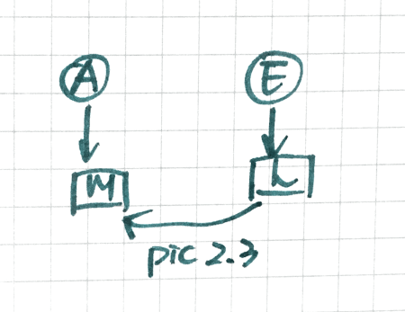

# A Record of My Problem Solving Journey.

Patterns for Coding Questions

#### Table Of Content
##### [Union Find](https://github.com/xrenaissance/A-Record-of-My-Problem-Solving-Journey#union-find)
##### [BFS](https://github.com/xrenaissance/A-Record-of-My-Problem-Solving-Journey#breadth-first-searchbfs)
##### [Subsets(DFS)](https://github.com/xrenaissance/A-Record-of-My-Problem-Solving-Journey#subsetsdfs-1)
##### [Sliding Window](https://github.com/xrenaissance/A-Record-of-My-Problem-Solving-Journey#sliding-window-1)
##### [Top K Elements](https://github.com/xrenaissance/A-Record-of-My-Problem-Solving-Journey#top-k-elements-1)
##### [Sweep Line](https://github.com/xrenaissance/A-Record-of-My-Problem-Solving-Journey#sweep-line-1)
##### [K-Way Merge](https://github.com/xrenaissance/A-Record-of-My-Problem-Solving-Journey#k-way-merge-1)
##### [Two Pointers](https://github.com/xrenaissance/A-Record-of-My-Problem-Solving-Journey#two-pointers-1)
##### [Slow and Faster Pointer](https://github.com/xrenaissance/A-Record-of-My-Problem-Solving-Journey#slow-and-faster-pointer-1)
##### [Topological Sort](https://github.com/xrenaissance/A-Record-of-My-Problem-Solving-Journey#topological-sort-1)
##### [Two Heaps](https://github.com/xrenaissance/A-Record-of-My-Problem-Solving-Journey#two-heaps-1)
##### [Math](https://github.com/xrenaissance/A-Record-of-My-Problem-Solving-Journey#math-1)
##### [Bit Operations](https://github.com/xrenaissance/A-Record-of-My-Problem-Solving-Journey#bit-operations-1)
##### [Data Structure Design And Implementation(Tries,HashMap,HashSet,ArrayToTree,Iterator)](https://github.com/xrenaissance/A-Record-of-My-Problem-Solving-Journey/blob/master/README.md#data-structure-design-and-implementationtrieshashmaphashsetarraytotreeiterator)
##### [Concurrency And Threads](https://github.com/xrenaissance/A-Record-of-My-Problem-Solving-Journey/blob/master/README.md#concurrency-and-threads)
##### [OOD](https://github.com/xrenaissance/A-Record-of-My-Problem-Solving-Journey/blob/master/README.md#ood)
##### [System Design](https://github.com/xrenaissance/A-Record-of-My-Problem-Solving-Journey/blob/master/README.md#system-design)
##### [Behavior Questions' Answer Template](https://github.com/xrenaissance/A-Record-of-My-Problem-Solving-Journey/blob/master/README.md#behavior-questions-answer-template)
<br></br>
###### [My Daily Coding Records](https://docs.google.com/spreadsheets/d/13oGqFxjJ6pWtuuxWlrWnczDdw-d1yoPx1T9U3GFxDCM/edit#gid=0)

## Getting Started

### Union Find

What is Union Find?

Union Find is data structure:

A, B, C, D are working in Microsoft, so each of them all point to Microsoft. So Microsoft is the set they belong to.

D, E, F, J are working in Linkedin, so all of these four point to Linkedin, the big brother is Linkedin, aka they belong to Linkedin.


So what does this set thing mean? Assuming A met F in a restaurant， A saw the ID card of F, A knows F is working in Linkedin, F knows A is working in M, they know they are not serving for same set(company). Then D comes, then F knows D is his co-worker.


After Microsoft merged Linkedin, the easiest way is to let Linkedin serve Microsoft. Then everyone in Linkedin knows their boss belongs to Microsoft, aka they also belong to Microsoft.



At this state, we don't need to use M and L for two different sets, we can choose their boss replace.

e.g M has A,B,C,D, we choose B(Bill Gates), Linkedin we choose J.


After L is merged. it becomes this,


#### There are three major operations for Union Find.

Initialization, Find, Union

1. Initialization

   After initialisation, father of each element is itself, aka I'm the boss of myself, it could be changed depend on different conditions. e.g.

   ```java
   public int[] father = null;
   public UnionFind(int n) {
     father = new int[n + 1];
     for (int i = 1; i <= n; i++) {
       father[i] = i;
     }
   }
   ```

  2. Find (Time complexity: O(1))

      To find which set this element belongs to, that means find its boss! This is also the basics we merge two sets.

      If two elements are in same set, do nothing, otherwise merge.

      ```java
      public int find(int x) {
        if (father[x] == x) {
          return x;
        }
        father[x] = find(father[x]);
        return father[x];
      }
      ```

   3. Union (Time Complexity(1))

         Merge two different sets, aka b becomes the boss of a.

         ```java
         public void union(int a, int b) {
            a = find(a);
            b = find(b);
            if (a != b) {
               father[a] = b;
            }
         }
         ```

         #### The time complexity of compressed union find.
         
         Union Find without compressing path
         
         ```java
         public int find(int x) {
            if (father[x] == x) {
               return x;
            }
            return find(father[x]);
         } 
         ```
         
         Union Find with compressing path.
         
         ```java
         public int find(int x) {
            if (father[x] == x) {
               return x;
            }
            father[x] = find(father[x]);
            return father[x];
         }
         ```
         
         The idea of compressing path
         
         Assuming there is a path, A -> B -> Z -> Y -> W, we want to know who's the boss of A, we have to go though A, B,Z,Y then W,  so every time, for each node has to go though again, aka redundant computation.
         
         The follwing graph shows how compressed path works.
         


Then a linked list becomes everyone points to boss.


So amortiezed time complexity of find is O(1), same as union, O(1) as well.

##### Questions which are solved via Union Find

Leetcode 130 Surrounded Regions

Leetcode 200 Number of Islands

Leetcdoe 305 Number of Islands 305

Leetcode 261 Graph valid Tree

Leetcode 547 Friend Circles

Leetcode 1135 Connecting Cities With Minimum Cost 


### Breadth First Search(BFS)

### Subsets(DFS)

### Sliding Window

### Sweep Line

### Top K Elements

### K-Way Merge

### Two Pointers

### Slow and Faster Pointer

### LinkedList

### Trees

### Cyclic Sort

### Binary Search

### Merge Intervals

### Dynamic Programming(DP)

### Tries

### Topological Sort

### Two Heaps

### Math

### Bit Operations

### Data Structure Design And Implementation(Tries,HashMap,HashSet,ArrayToTree,Iterator)

### Concurrency And Threads

### OOD

### System Design

### Behavior Questions' Answer Template
